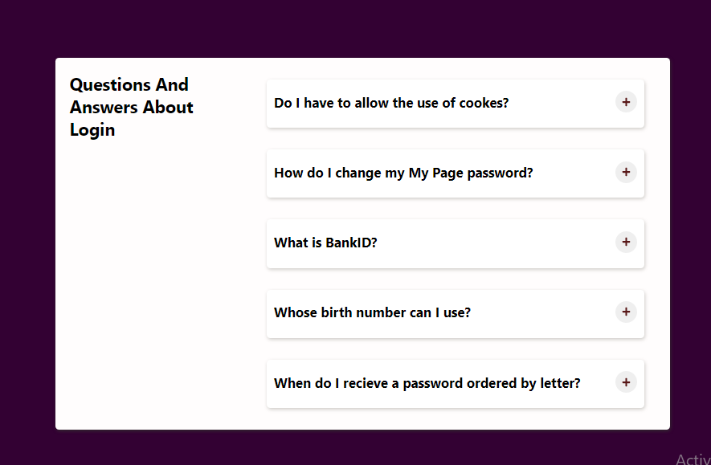
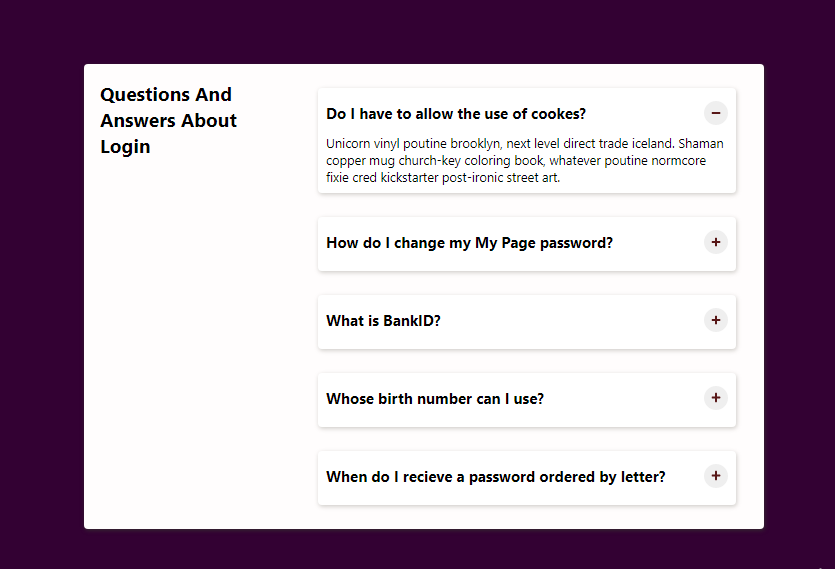
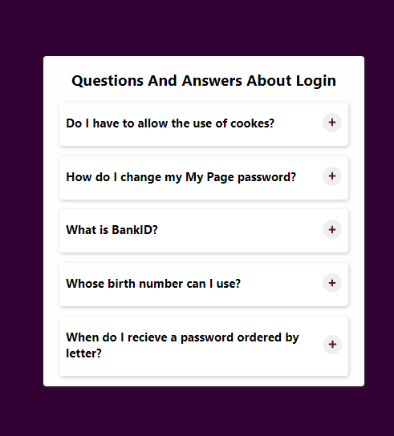
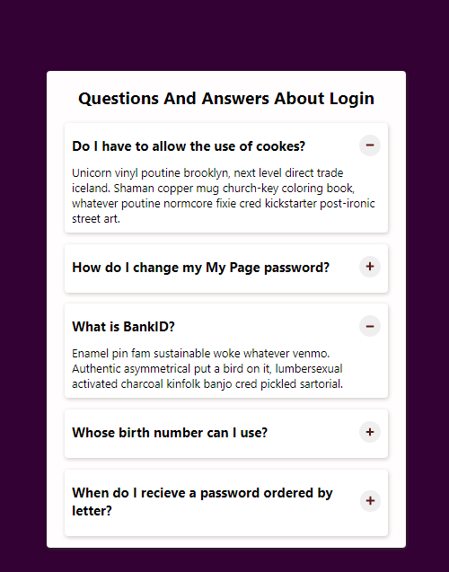

# Accordion
A Complete Design of An Accordion Using React

 Built A minor project during the course of React learning, the project is an accordion about 
 Questions and Answer about Login the below figure present a vivid description of how it work.

